# Last Exhibit — Epochen & Settings

---

## Epoche 1 — Sowjetunion

**Setting:** Geheimer Forschungsbunker, Sibirien — 1960–1980

Unterirdischer Sowjet-Bunker. Labore, Käfige, Röhren die in Wände verschwinden. Experimente die offensichtlich schiefgelaufen sind. Kein Tageslicht. Der Bunker lebt irgendwie noch.

**Vibe:**

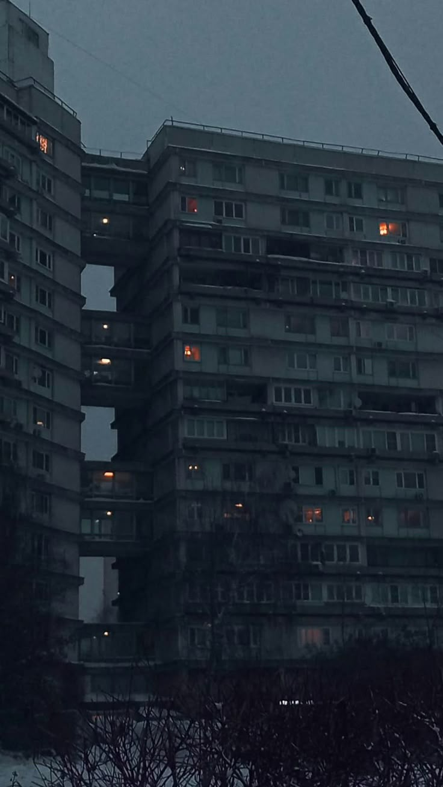
.jpeg)
.jpeg)
.jpeg)
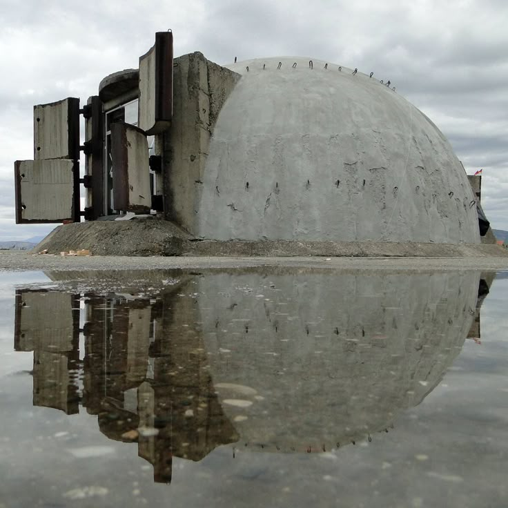
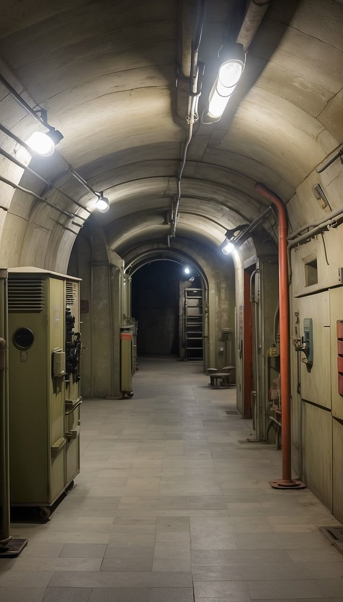

**Tageszeit:** Kein Tageslicht — ewige künstliche Beleuchtung, manche Sektionen komplett dunkel

**Farbpalette:** Kaltes Grün, vergilbtes Weiß, Rostbraun, rote Warnleuchten

**Gegner:**
- Militärwissenschaftler — schwach, rufen sofort Alarm
- Bewaffnete Soldaten — Standardwächter
- Wachhunde — schnell, lautlos
- Etwas das in den Käfigen war und jetzt nicht mehr drin ist — TBD

**Artefakte:**

| Artefakt | Kategorie | Größe | Besonderheit |
|----------|-----------|-------|--------------|
| Fabergé-Ei | Normal | Groß | Höchster Ruhm der Epoche |
| Sputnik-Modell | Normal | Groß | — |
| Geheimes Forschungsgerät | Fragmentiert | Mittel | Set mit Labortagebuch |
| Labortagebuch eines Wissenschaftlers | Fragmentiert | Klein | Set mit Forschungsgerät |
| Versuchsprotokoll | Verboten | Klein | — |
| Klassifizierte Akte | Verboten | Klein | — |
| Propaganda-Poster | Verboten | Mittel | — |
| Verbotene Schallplatte (Jazz) | Verboten | Klein | — |
| KGB-Abzeichen | Normal | Klein | — |
| Sowjet-Orden | Normal | Klein | — |
| Geigerzähler | Normal | Mittel | — |
| Gasmaske | Normal | Mittel | — |
| Telefonhörer aus Direktorenbüro | Normal | Klein | — |
| Chemisches Präparat in Glasflasche | Lebendig | Mittel | Braucht Sondervitrine |

**Boss: Laborleiter**
- Typ: Maschinentyp
- Nutzt Bunker-Technologie als Waffe — Elektroschocks, Druckluft, Sicherheitsgitter
- Schwachstellen durch Erkundung des Labors finden

**Atmosphäre:** Paranoia, Körnerfilm, das Gefühl beobachtet zu werden auch wenn niemand da ist

---

## Epoche 2 — Zweiter Weltkrieg

**Setting:** Amerikanische Airforce Base, England — 1943

Aktive US-Airforce Base kurz vor Morgengrauen. Hangars, Rollbahnen, Kontrollturm, unterirdisches Archiv. Flugzeuge starten bald — Zeitdruck von Anfang an spürbar.

**Vibe:**

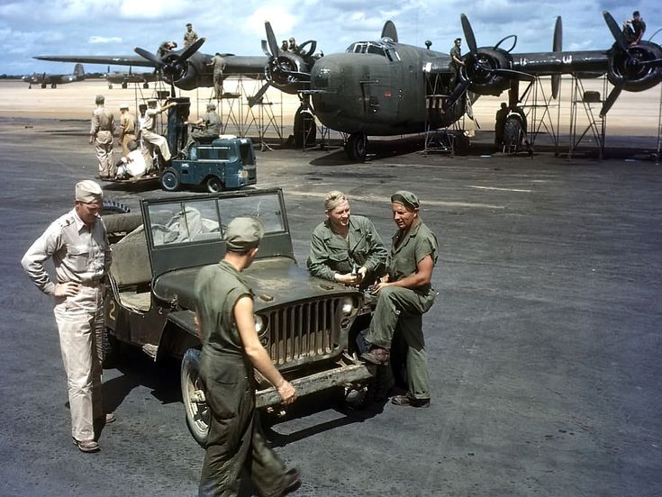
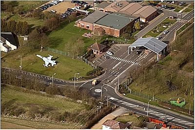
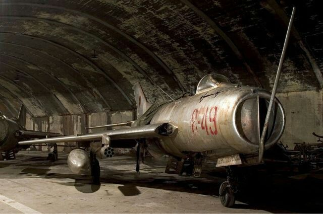
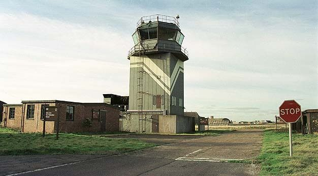
 on X.jpeg)
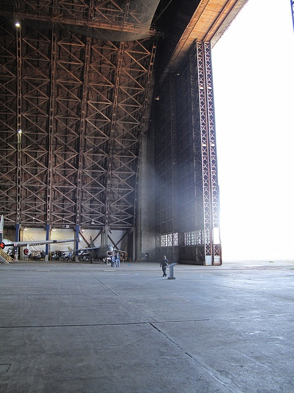
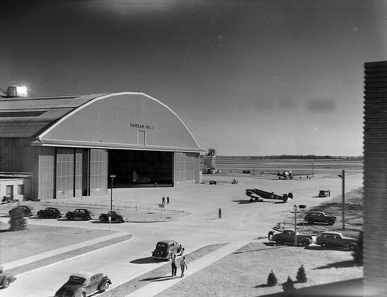

**Tageszeit:** Kurz vor Morgengrauen — Uhr tickt

**Farbpalette:** Industrielles Graugrün, Kerosingelb, Nachtblau, Scheinwerferweiß

**Gegner:**
- MPs (Military Police) — schwer, rufen sofort Verstärkung
- Mechaniker — neutral bis feindlich wenn alarmiert
- Wachhunde — patrouillieren Rollbahn
- Sicherheitszäune — unter Strom

**Artefakte:**

| Artefakt | Kategorie | Größe | Besonderheit |
|----------|-----------|-------|--------------|
| Beschlagnahmtes Gemälde | Normal | Groß | Höchster Ruhm der Epoche |
| Kettenhemd — nein, falsche Epoche | — | — | — |
| Fliegerjacke | Normal | Mittel | — |
| Pilotenhelm | Normal | Mittel | — |
| Bordkamera einer P-51 | Fragmentiert | Mittel | Set mit Feldtelefon |
| Beschlagnahmte Geige aus Frankreich | Fragmentiert | Mittel | — |
| Geheime Kriegskarte | Verboten | Mittel | — |
| Militärische Geheimkarte | Verboten | Mittel | — |
| Enigma-ähnliches Gerät | Fragmentiert | Mittel | Set mit Bordkamera |
| Pilotenabzeichen | Normal | Klein | — |
| Patronengürtel | Normal | Klein | — |
| Medaille | Normal | Klein | — |
| Feldtelefon | Fragmentiert | Mittel | Set mit Bordkamera |
| Tarnanzug | Normal | Mittel | — |

**Boss: Kampfjet — P-51 Mustang**
- Typ: Maschinentyp
- Steht in Hangar — startet wenn Alarm ausgelöst wird
- Direkter Kampf unmöglich
- Triebwerk, Räder, Funkantenne müssen sabotiert werden bevor er abhebt
- Wenn er abhebt ist die Nacht verloren — sofortige Rückkehr erzwungen

**Atmosphäre:** Industriell, laut in der Ferne, das Gefühl jederzeit entdeckt zu werden

---

## Epoche 3 — Mittelalter

**Setting:** Mächtige Burg, Frankreich — 1200er

Große Burg bei Gewitter. Burghof, Türme, Verliese darunter, Waffenkammer, Schatzkammer ganz oben. Das Gewitter macht jeden Donner zur Tarnung — und jeden Blitz zur Gefahr.

**Vibe:**

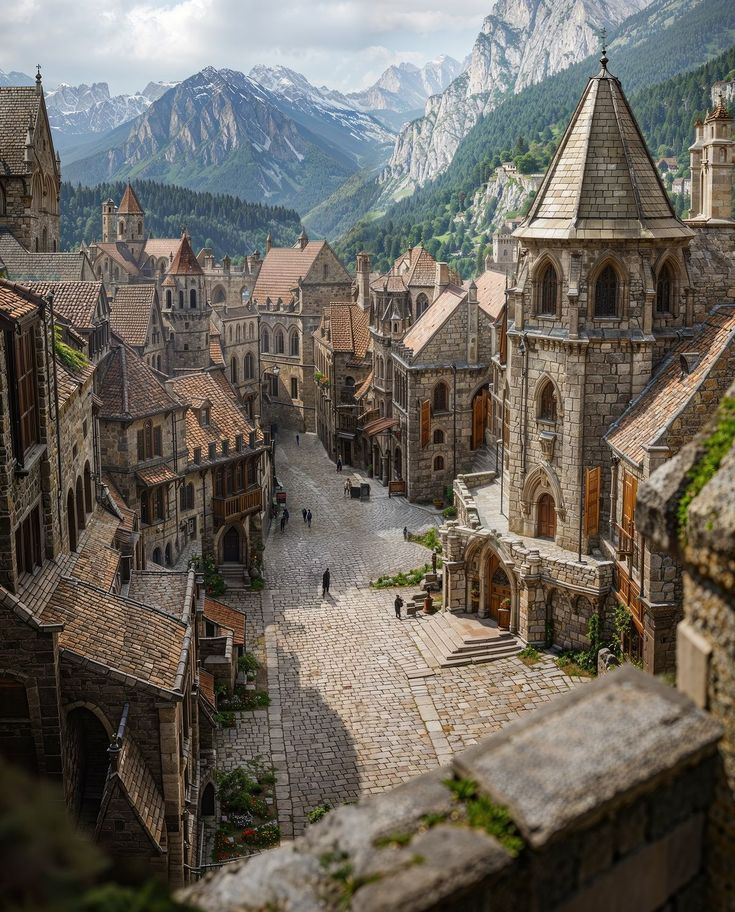
.jpeg)
.jpeg)
.jpeg)
.jpeg)
.jpeg)
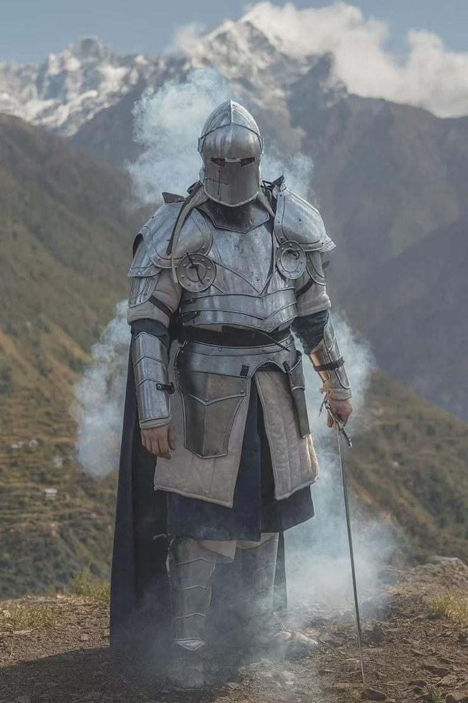

**Tageszeit:** Mitternacht, Gewitter

**Farbpalette:** Steingrau, Fackeltöne, Nachtblau, Blitzweiß

**Gegner:**
- Ritter in Rüstung — langsam aber fast unverwundbar von vorne
- Bogenschützen auf Zinnen — Distanzgefahr
- Diener des Burgherren — schwach, rufen Alarm
- Blitzeinschläge — Umgebungsgefahr auf Außenbereichen

**Artefakte:**

| Artefakt | Kategorie | Größe | Besonderheit |
|----------|-----------|-------|--------------|
| Schwert des Burgherren | Verboten | Groß | Höchster Ruhm der Epoche |
| Kettenhemd | Normal | Groß | Sehr schwer — stark verlangsamend |
| Ritterhelm | Normal | Mittel | — |
| Kriegsaxt | Normal | Mittel | — |
| Burgherren-Wappen | Normal | Mittel | — |
| Bibel des Burgherren | Fragmentiert | Klein | Set mit Pergamentkarte |
| Pergamentkarte | Fragmentiert | Klein | Set mit Bibel |
| Goldener Kelch aus Burgkapelle | Normal | Mittel | — |
| Wachssiegel | Normal | Klein | — |
| Kerzenhalter aus der Kapelle | Normal | Klein | — |
| Armbrustbolzen-Bündel | Normal | Klein | — |
| Giftflasche aus dem Verlies | Verboten | Klein | — |

**Boss: Der Burgherr**
- Typ: Wächtertyp
- Schwere Rüstung, langsam aber unaufhaltsam
- Von vorne unverwundbar — Schwachstelle nur von hinten
- Bei niedrigen HP ruft er Bogenschützen — Kampf wird zum Chaos

**Atmosphäre:** Massiv, kalt, klaustrophobisch in den Verliesen — weit und gefährlich oben auf den Zinnen

---

## Epoche 4 — Samurai-Tempel

**Setting:** Abgelegener Shinto-Tempel, Japan — Edo-Zeit

Mächtiger abgelegener Tempel im Gebirge. Torii-Tore, Räucherstäbchen, Mondlicht durch Bambushaine, heilige Innenhöfe. Absolute Stille. Jeder Schritt hörbar.

**Vibe:**

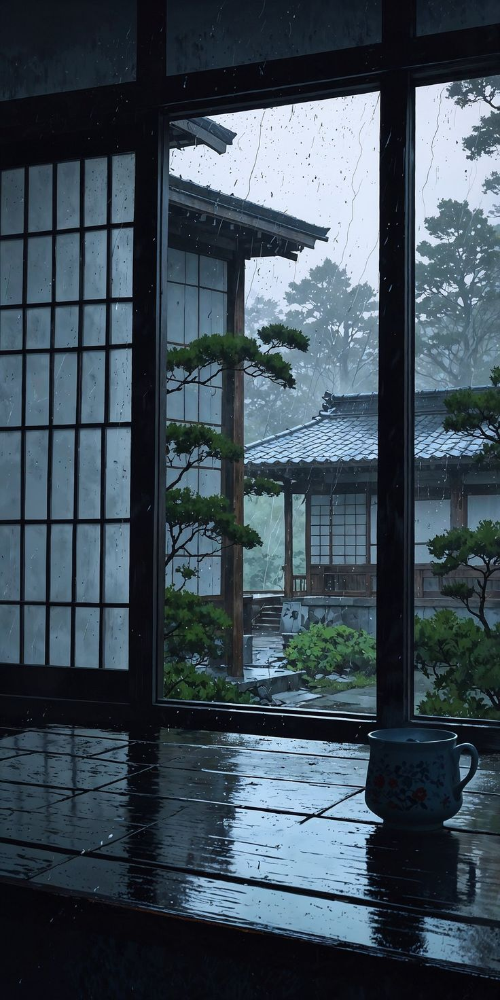
.jpeg)
.jpeg)
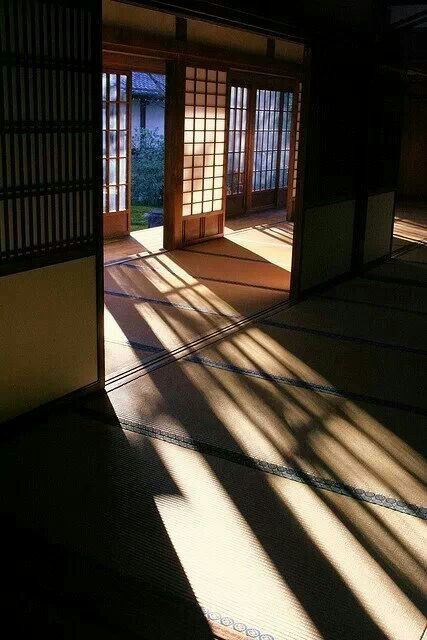
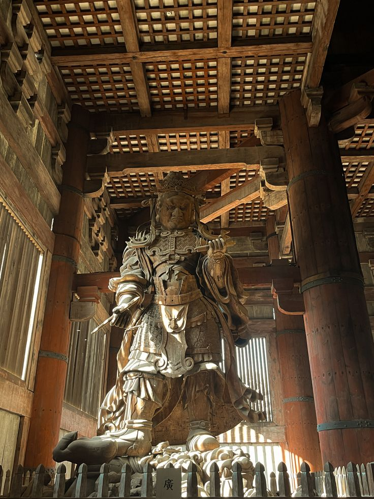
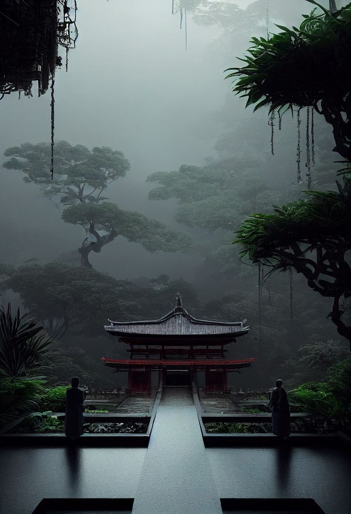
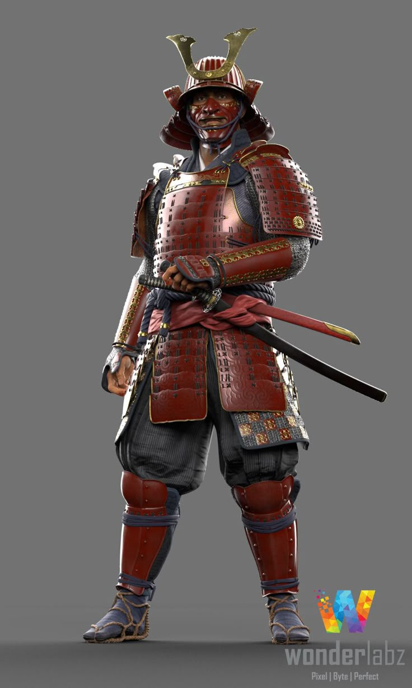
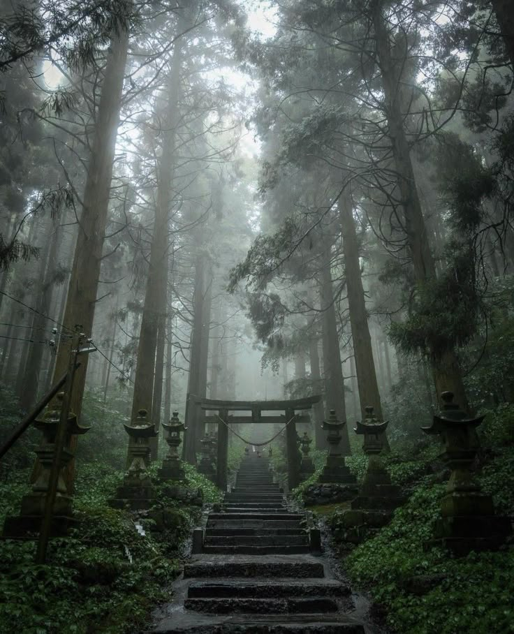

**Tageszeit:** Vollmondnacht, dicker Nebel

**Farbpalette:** Tiefes Dunkelblau, Mondsilber, Kirschblütenrosa, warmes Kerzengold

**Gegner:**
- Tempelwächter — diszipliniert, patrouillieren in Formationen
- Ninja-Assassinen — tauchen aus dem Schatten auf, lautlos
- Mönche — überraschend gefährlich, kennen den Tempel blind
- Tempel-Glocke — Umgebungsgefahr, löst Alarm aus wenn berührt

**Artefakte:**

| Artefakt | Kategorie | Größe | Besonderheit |
|----------|-----------|-------|--------------|
| Heiliges Katana | Verboten | Groß | Höchster Ruhm der Epoche |
| Lack-Rüstung | Normal | Groß | — |
| Bogen + Köcher | Normal | Groß | — |
| Buddhastatue | Normal | Groß | — |
| Noh-Theater-Maske | Verboten | Mittel | — |
| Zeremonielle Maske | Normal | Mittel | — |
| Tee-Zeremonieset | Fragmentiert | Mittel | Set mit Kalligraphie-Rolle |
| Sake-Krug aus dem 16. Jahrhundert | Normal | Mittel | — |
| Ritualtrommel | Normal | Mittel | — |
| Tempel-Glocke (Miniatur) | Normal | Mittel | — |
| Kalligraphie-Rolle | Fragmentiert | Klein | Set mit Tee-Zeremonieset |
| Gebetsperlen des Abts | Normal | Klein | — |
| Shuriken-Set | Normal | Klein | Verboten wenn entdeckt |
| Jade-Siegel | Normal | Klein | — |

**Boss: Samurai — Meister des Tempels**
- Typ: Menschentyp
- Besuch 1: Unbesiegbar — David muss fliehen
- Besuch 2: Kennt Davids Tricks — neue Strategie nötig
- Besuch 3: Besiegbar — nur wenn David seinen Schwachpunkt im Tempel entdeckt hat

**Atmosphäre:** Ehrfurcht, Präzision, Stille als aktive Bedrohung

---

## Epoche 5 — Inka-Tempel

**Setting:** Riesiger unterirdischer Inka-Tempel, tief im Dschungel — vor der Conquista

Massiver mehrstöckiger Tempel. Goldsäle, Fallen überall, kein Ende sichtbar. David ist winzig gegen die Architektur. Lichtstrahlen vor Sonnenaufgang zeigen wo Fallen sind.

**Vibe:**

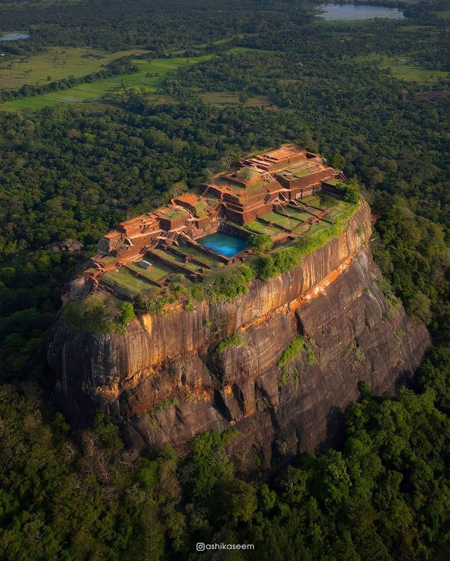
.jpeg)
.jpeg)
.jpeg)
.jpeg)
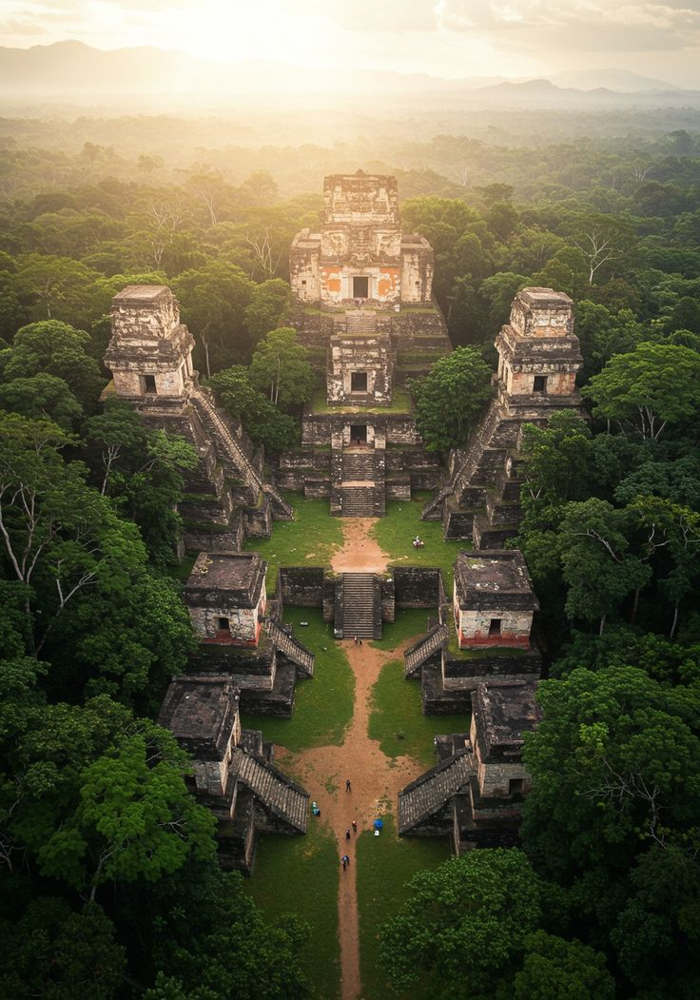
.jpeg)
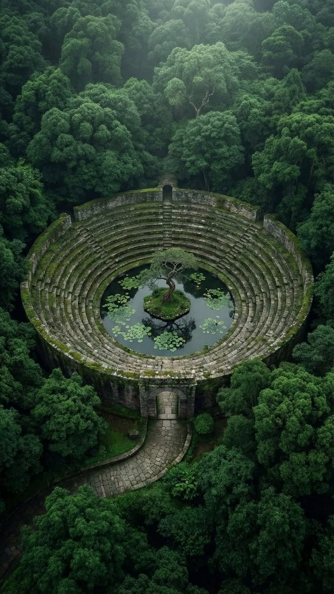
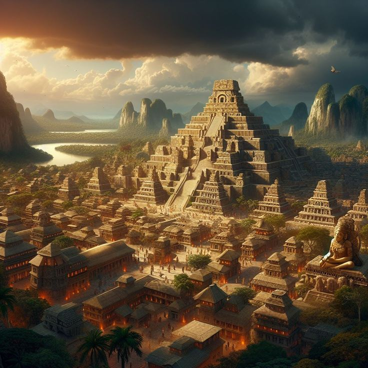

**Tageszeit:** Kurz vor Sonnenaufgang — Licht als Gameplay-Hinweis auf Fallen

**Farbpalette:** Steingrau, Goldgelb, Dschungelgrün, warmes Orangelicht

**Gegner:**
- Tempelpriester — beschwören Verstärkung
- Jaguarwächter — schnell, aggressiv
- Mechanische Fallenreihen — Stacheln, Rollsteine, Fallgruben
- Abgründe ohne Boden — überall

**Artefakte:**

| Artefakt | Kategorie | Größe | Besonderheit |
|----------|-----------|-------|--------------|
| Sonnenscheibe | Verboten | Riesig | Braucht Schleppsystem-Upgrade, höchster Ruhm |
| Goldmaske | Normal | Groß | Physisch tragen |
| Federheadress | Fragmentiert | Groß | Set mit Steinkarte |
| Goldener Jaguar | Normal | Mittel | — |
| Goldener Kelch | Normal | Mittel | — |
| Ritualtrommel | Normal | Mittel | — |
| Steinkarte des Tempels | Fragmentiert | Mittel | Set mit Federheadress |
| Weberei mit astronomischem Muster | Fragmentiert | Mittel | — |
| Quipu-Knoten | Fragmentiert | Klein | — |
| Obsidiandolch | Verboten | Klein | — |
| Goldene Armbänder | Normal | Klein | Stapelbar |
| Goldene Sandalen des Priesters | Normal | Klein | — |
| Keramikgefäß mit Opferpflanze | Lebendig | Mittel | Braucht Sondervitrine |
| Mumifizierte Hand | Verboten + Lebendig | Klein | Höchstes Risiko — Herr K. reagiert |

**Boss: Hohepriester**
- Typ: Ritualtyp
- Steht auf Altar der ihm kontinuierlich Energie gibt
- Vier Säulen im Raum deaktivieren — dann erst verwundbar
- Aktive Fallen während des gesamten Kampfes

**Atmosphäre:** Monumental, überwältigend, David ist winzig gegen die Architektur

---

## Epochen-Reihenfolge (Zeittiefe-Stufen)

| Stufe | Epoche | Zeitraum |
|-------|--------|----------|
| 1 | Sowjetunion | 1960–1980 |
| 2 | Zweiter Weltkrieg | 1943 |
| 3 | Mittelalter | 1200er |
| 4 | Samurai-Tempel | Edo-Zeit 1600–1868 |
| 5 | Inka-Tempel | Vor 1532 |

---

## Artefakt-Kategorien Übersicht

| Kategorie | Beschreibung | Museum-Effekt |
|-----------|--------------|---------------|
| Normal | Standard — kein besonderes Risiko | Ruhm |
| Fragmentiert | Kaputt — allein wertlos, Sets = Bonus | Ruhm wenn Set komplett |
| Verboten | Illegal — nicht ausstellbar ohne Risiko | Schwarzmarktmünzen |
| Lebendig | Organisch — braucht Sondervitrine | Forschungsbudget |
| Verboten + Lebendig | Beides gleichzeitig | Höchstes Risiko, höchster Wert |

---

*Last Exhibit — Epochen v0.3*
*Weitere Epochen: TBD*
